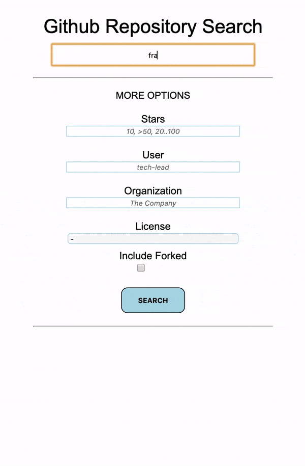

# GitHub Repository Search

#### Search for GitHub repositories based on text, number of stars, user, organization, and license. You have the option of including forked repositories.

This web app supports setting form fields and the current page via query parameters. Click the search button or hit enter in the URL to initiate a search for repositories with your desired inputs and see results displayed below.

This project was built with React.js, Redux, HTML, CSS, Javascript.

<p align="center">
  
</p>

### To run locally:
```
npm install

npm start
```
